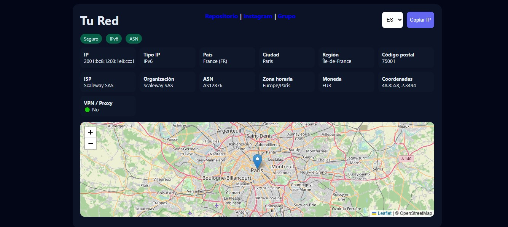

# 🌐 Iwakura Dashboard


> Dashboard de red en tiempo real con detección de IP, geolocalización y análisis básico de seguridad.

---

## 🚀 Características

- 🌍 Detección automática de IP pública
- 📍 Geolocalización (país, ciudad, región)
- 🛰️ ISP, ASN y organización
- 🧭 Zona horaria y moneda
- 🗺️ Mapa interactivo con Leaflet
- 🛡️ Detección básica de VPN / Proxy
- 🔁 Soporte multilenguaje (ES / EN)
- 📋 Copiado rápido de IP
- 📊 Sistema de badges de estado visual
- 🧾 Logger personalizado en backend

---

## 🧠 Tecnologías usadas

### Frontend
- HTML5
- CSS3
- JavaScript (Vanilla)
- Leaflet.js (mapas)

### Backend
- Node.js
- Express.js

### APIs
- ipapi.co
- ipwho.is (fallback)

---

## 📂 Estructura del proyecto
```
Iwakura/
│
├── dashboard/
│ ├── index.html
│ ├── css/
│ └── app/
│ └── script.js
│
├── logger.js
├── server.js
└── package.json
```


---

## ⚙️ Instalación

```bash
git clone https://github.com/NeoEurus/Iwakura.git
cd Iwakura
npm install
node server.js
```

## ▶️ Uso

Abre tu navegador en:

```
http://localhost:3000
```

## 🧾 Logger

Incluye un sistema de logs con niveles:

- INFO
- WARN
- ERROR
- DEBUG

Ejemplo:

```
2026-04-15T06:25:33.412Z [INFO] Servidor corriendo en http://localhost:3000
```

## 🛡️ Detección de VPN

El sistema usa dos métodos:

1. API directa (si disponible)
2. Heurística basada en ISP:
   - Palabras clave como:
     - vpn
     - proxy
     - cloud
     - aws
     - google
     - azure

⚠️ Nota: No es 100% precisa, es una detección aproximada.

---

## 🌐 Idiomas soportados

- 🇪🇸 Español
- 🏴󠁧󠁢󠁥󠁮󠁧󠁿 Inglés

<h5>Más idiomas próximamente…</h5>

---

## 🤝 Contribuciones

Las contribuciones son bienvenidas:

1. Fork del proyecto  
2. Crea una rama (`feature/nueva-funcion`)  
3. Commit  
4. Push  
5. Pull Request  

---


## 📜 Licencia

MIT License

---

## 👤 Autor

Desarrollado por **Eurus**

- GitHub: https://github.com/NeoEurus
- Contacto: @EurusBuran | Instagram & Telegram
- Grupo: @BlackDragonCrew en Telegram

---

## 📸 Captura de Pantalla


---
## ⚡ Notas

- Este proyecto es educativo / informativo  
- No recolecta datos del usuario en servidor  
- Todo se consulta en tiempo real desde APIs públicas

<h6>Hecho con 🖤 por Eurus</h6>
